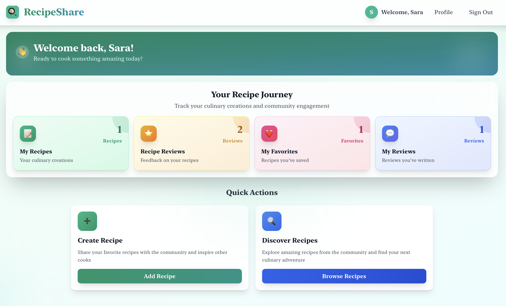
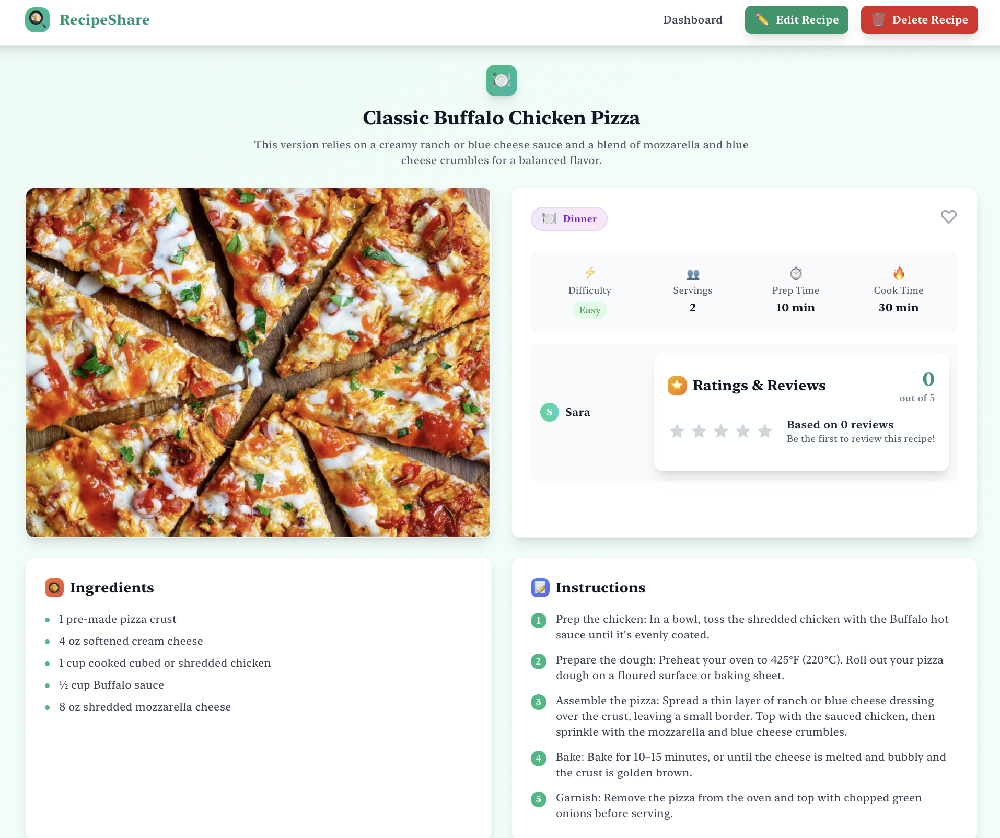
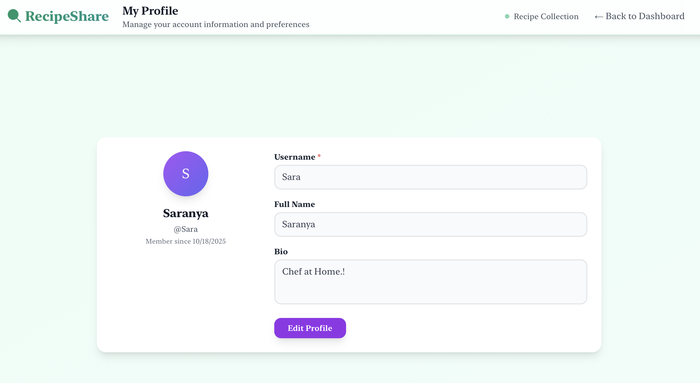
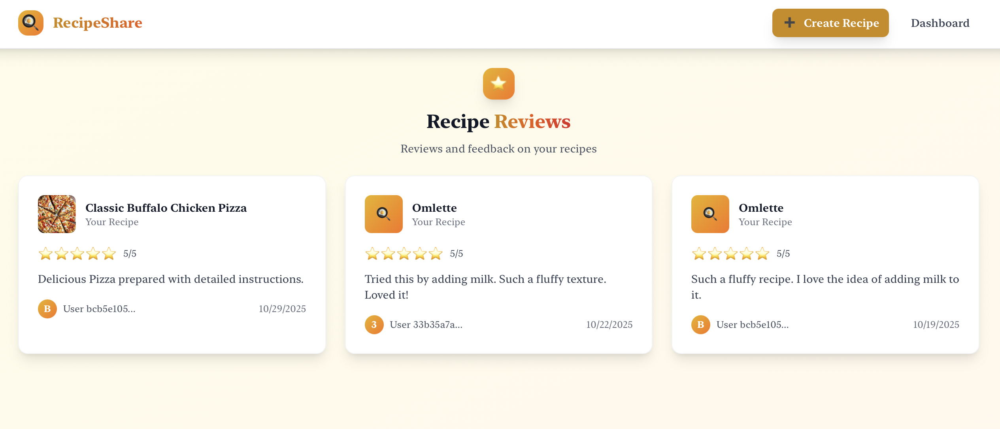
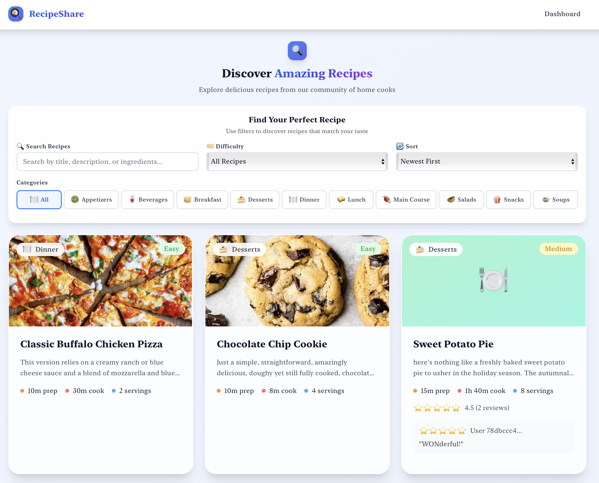

# RecipeShare  
A modern recipe-sharing web app built with **Next.js 15**, **React 19**, **Supabase**, and **Tailwind CSS**.

---

## 📌 What it is  
RecipeShare is a full-stack application where food lovers can **create**, **discover**, and **share** recipes.  
Users can upload recipes with images, save favourites, rate and review, browse by category/difficulty, and manage their profile.  
The goal: make sharing and finding great home-cooking easy and social.

---

## 🎯 Why it matters  
Home-cooks often juggle scattered tools — note-apps, social media, cookbooks.  
RecipeShare centralises this, adds social features (reviews, favourites), and wraps it all in a clean, modern UI.  
It’s built to let anyone go from idea → publish in minutes.

---

## 🛠️ Key Features  
- User authentication (signup, login, logout) via Supabase  
- CRUD for recipes (title, ingredients, steps, category, difficulty, image)  
- Recipe discovery: browse, search, filter by category/difficulty, sort by popularity  
- User profiles with personal info, recipes, and reviews  
- Favourites system to save recipes you like  
- Ratings & comments (1–5 stars + comments)  
- Image uploads via Supabase Storage  
- Responsive, mobile-first UI (Tailwind CSS)  
- Grid/List recipe views  
- Smooth UX with loading states, toasts, and error handling  
- TypeScript for full type safety  
- Server + Client Components (Next.js App Router)  
- Supabase RLS (Row-Level Security)  
- SEO-optimized structure and meta tags  

---

## 🎬 Screenshots  
  
  



---

## 🚀 Quick Start  

### Prerequisites  
- Node.js 18.17 or later  
- npm or yarn  
- Supabase account  
- Git  

### Installation  
```bash
git clone <YOUR_REPO_URL>
cd recipeshare
npm install
````

### Configuration

Create a file `.env.local` in the root directory and add:

```env
NEXT_PUBLIC_SUPABASE_URL=your_supabase_project_url
NEXT_PUBLIC_SUPABASE_ANON_KEY=your_supabase_anon_key
```

### Setup Supabase

1. In your Supabase dashboard, go to **Storage** → create a bucket named `recipe-images`.
2. Set the bucket as **public** (or configure access to your preference).
3. Configure RLS policies for the `recipes`, `reviews`, and `favourites` tables.

### Run the app

```bash
npm run dev
```

Visit [http://localhost:3000](http://localhost:3000) in your browser.

---

## 📂 Project Structure

```
src/
├── app/                # Next.js App Router pages and layouts
│   ├── create-recipe/
│   ├── favourites/
│   ├── my-recipes/
│   ├── profile/
│   ├── recipes/
│   │   ├── [id]/
│   │   │   └── edit/
│   │   └── page.tsx
│   ├── dashboard/
│   ├── layout.tsx
│   └── globals.css
├── components/         # Reusable UI components
├── lib/                # Utility modules (auth context, Supabase client)
├── public/             # Static assets
├── .env.local          # Local env vars (gitignored)
├── tailwind.config.ts  # Tailwind config
├── tsconfig.json       # TypeScript config
├── next.config.ts      # Next.js config
└── package.json
```

---

## 🚀 Deployment

### Deploy to Vercel

1. Go to [Vercel](https://vercel.com) → **Add New Project** → select this GitHub repo.
2. Add your Supabase environment variables:

   ```env
   NEXT_PUBLIC_SUPABASE_URL=your_supabase_url
   NEXT_PUBLIC_SUPABASE_ANON_KEY=your_supabase_anon_key
   ```
3. Click **Deploy** — Vercel builds and hosts automatically.
4. Your app will be live at a URL like `https://recipeshare.vercel.app`.
5. *(Optional)* Add a custom domain under **Settings → Domains**.

---

## 📈 Roadmap

**Planned**

* Social sharing (share recipes or copy link)
* Recipe collections (personal “cookbooks”)
* Ingredient-based search
* Meal planning & shopping lists

**Long-Term / Maybe**

* Recipe scaling (adjust ingredients)
* Nutritional information
* Print-friendly recipe cards
* Import recipes from external URLs

---

## 🤝 Contributing

Contributions are welcome!

1. Fork the repository
2. Create a new branch (`git checkout -b feature/your-feature`)
3. Make changes and commit
4. Push to your fork and open a Pull Request
5. Follow the existing style (Tailwind + TypeScript)
6. Add docs/tests for new features

---

## 👤 Author

**Saranya Achanti**

---

## 🙏 Acknowledgments

* Thanks to the **Next.js** team for the framework
* Thanks to **Supabase** for backend services
* Thanks to **Tailwind Labs** for the styling system
* Inspired by many recipe-sharing sites and open-source communities