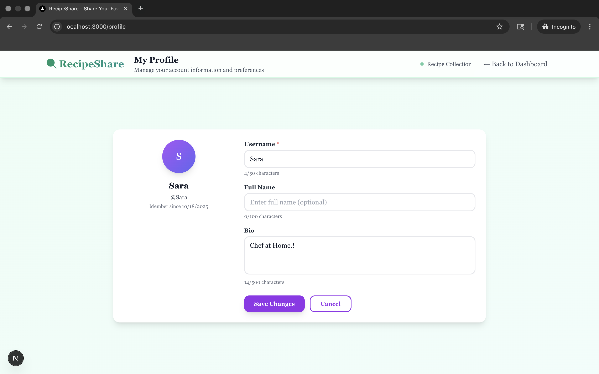
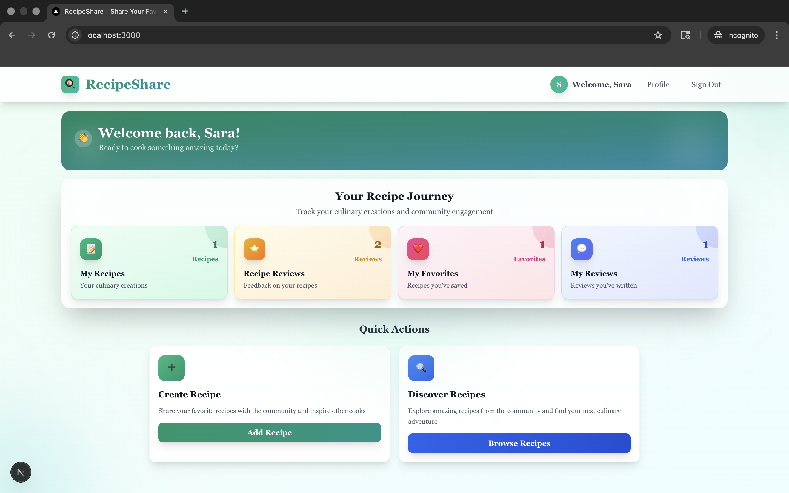
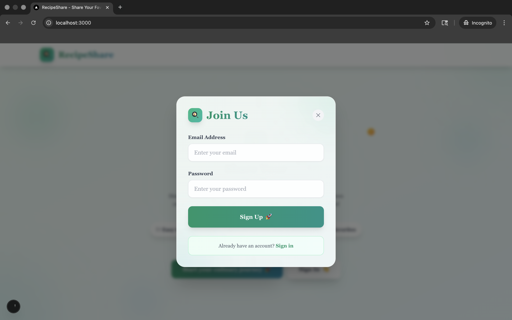
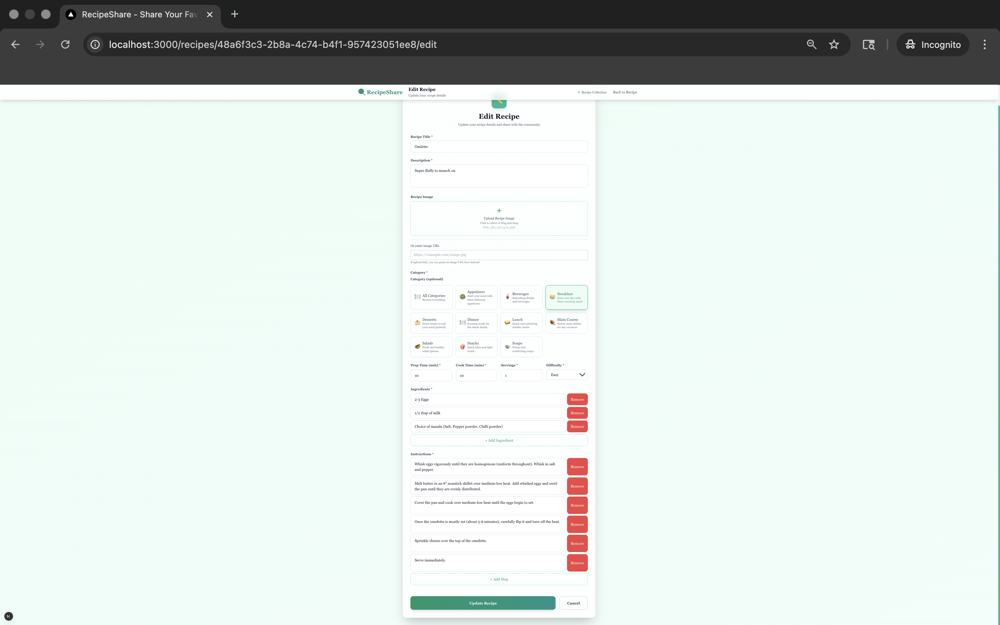
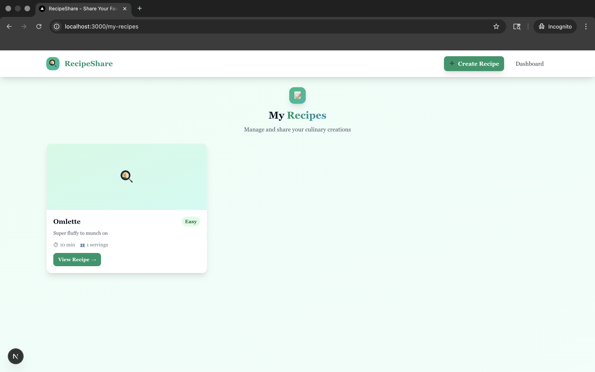
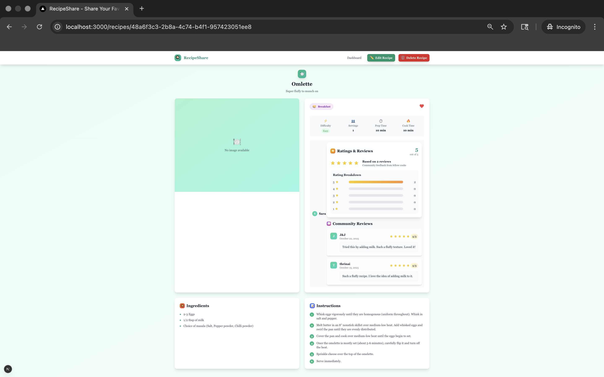
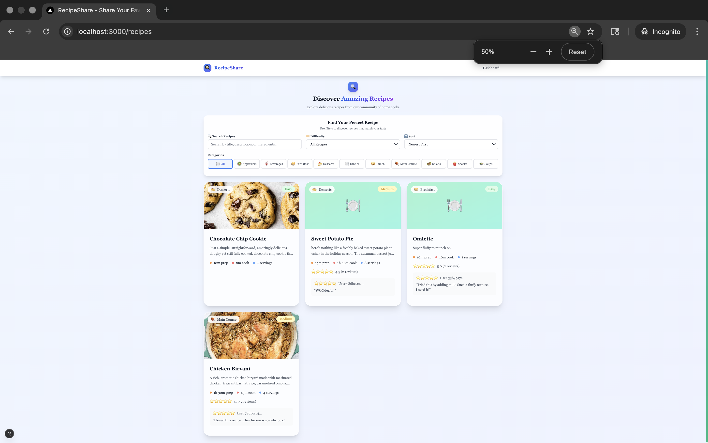
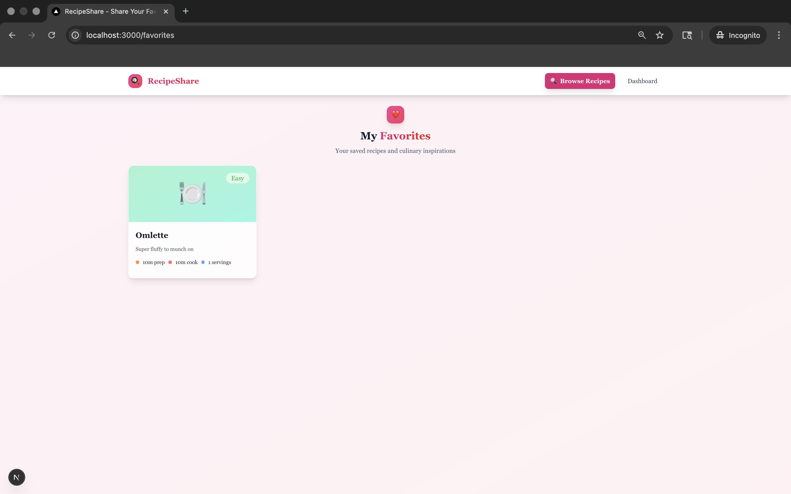
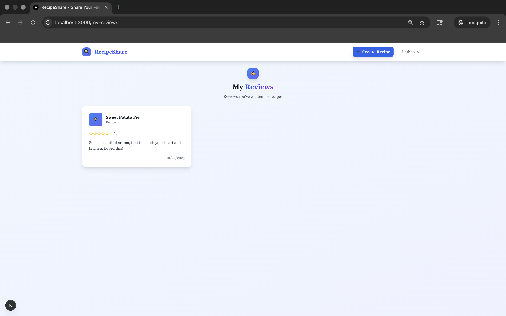

# RecipeShare 

Live Demo: https://recipesharing-pied.vercel.app

A modern recipe-sharing web app built with **Next.js 15**, **React 19**, **Supabase**, and **Tailwind CSS**.

---

## 🧭 TL;DR for Reviewers
- Full-stack Next.js + Supabase MVP  
- Working features: Auth, CRUD, Reviews, Favourites  
- **Docs include:** Architecture • ERD • User Flow (Mermaid)  
- Ready for extension to other domains (e.g., feedback summarizer, ops workflows)

---

## 📌 What it is  
RecipeShare is a full-stack application where food lovers can **create**, **discover**, and **share** recipes.  
Users can upload recipes with images, save favourites, rate and review, browse by category/difficulty, and manage their profile.  
The goal: make sharing and finding great home-cooking easy and social.

---

## 🎯 Why it matters  
Home-cooks often juggle scattered tools — note-apps, social media, cookbooks.  
RecipeShare centralises this, adds social features (reviews, favourites), and wraps it all in a clean, modern UI.  
It’s built to let anyone go from idea → publish in minutes.

---

## 🛠️ Key Features  
- User authentication (signup, login, logout) via Supabase  
- CRUD for recipes (title, ingredients, steps, category, difficulty, image)  
- Recipe discovery: browse, search, filter by category/difficulty, sort by popularity  
- User profiles with personal info, recipes, and reviews  
- Favourites system to save recipes you like  
- Ratings & comments (1–5 stars + comments)  
- Image uploads via Supabase Storage  
- Responsive, mobile-first UI (Tailwind CSS)  
- Grid/List recipe views  
- Smooth UX with loading states, toasts, and error handling  
- TypeScript for full type safety  
- Server + Client Components (Next.js App Router)  
- Supabase RLS (Row-Level Security)  
- SEO-optimized structure and meta tags  

---

## Screenshots

Here’s a visual walkthrough of key pages and flows inside **RecipeShare**.
---
### 🧭 User Flow (Mermaid Export)


---
### Architecture 
  
### Database - ERD


---
### User & Profile  
  
### Supabase Schema


---
### 🏠 Core Screens  
  

  



---

### 🍳 Recipe Creation & Management  
  

  

  



---

### 🔍 Discovery & Interaction  
  

  

  

  

---

## 🚀 Quick Start  

### Prerequisites  
- Node.js 18.17 or later  
- npm or yarn  
- Supabase account  
- Git  

### Installation  
```bash
git clone <YOUR_REPO_URL>
cd recipe_sharing
npm install
```

### Configuration

Create a file `.env.local` in the root directory and add:

```env
NEXT_PUBLIC_SUPABASE_URL=your_supabase_project_url
NEXT_PUBLIC_SUPABASE_ANON_KEY=your_supabase_anon_key
```

### Setup Supabase

1. Run the database schema: See [Setup Guide](./docs/setup/SUPABASE_SETUP.md) for detailed instructions
   - Copy contents of [`docs/setup/sql/supabase-schema.sql`](./docs/setup/sql/supabase-schema.sql) into Supabase SQL Editor
2. Set up storage bucket:
   - **Option A:** Run [`docs/setup/sql/setup-storage.sql`](./docs/setup/sql/setup-storage.sql) in SQL Editor
   - **Option B:** In Supabase dashboard → **Storage** → create bucket named `recipe-images` → set as **public**

### Run the app

```bash
npm run dev
```

Visit [http://localhost:3000](http://localhost:3000) in your browser.

---

## 🧪 Testing Checklist

To fully verify the app, test these features in a browser:

### Authentication
- [ ] Sign up (create new account)
- [ ] Sign in (login with existing account)
- [ ] Sign out (logout functionality)

### Recipe Management
- [ ] Create recipe with image upload
- [ ] View recipes list (discover page)
- [ ] View recipe details
- [ ] Edit recipe
- [ ] Delete recipe (if implemented)

### Social Features
- [ ] Rate and review recipes
- [ ] Add/remove favorites
- [ ] View user profile
- [ ] View dashboard stats
- [ ] View recipe reviews received

### Navigation
- [ ] All navigation links work
- [ ] Mobile navigation (if applicable)
- [ ] Breadcrumbs/navigation flow

---

## 🔧 Troubleshooting

### Common Issues

**App loads but database features don't work:**
- Check that `.env.local` exists with correct Supabase credentials
- Verify Supabase project is active and accessible
- Check browser console for connection errors

**Database connection fails:**
- Verify `NEXT_PUBLIC_SUPABASE_URL` and `NEXT_PUBLIC_SUPABASE_ANON_KEY` are correct
- Check Supabase project settings → API for correct values
- Ensure database schema has been run (see [Setup Guide](./docs/setup/SUPABASE_SETUP.md))

**Images don't upload:**
- Verify storage bucket `recipe-images` exists in Supabase
- Check bucket is set to public or has proper RLS policies
- See [Storage Setup](./docs/setup/SUPABASE_SETUP.md#5-storage-setup-optional)

**Console messages:**
- `console.log()` and `console.error()` messages are normal for debugging
- Error logs indicate handled errors (app continues to function)
- Auth timeout messages are expected if session takes time to load

---

## 📚 Documentation

For detailed documentation, see the [docs](./docs/) directory:

- **[Setup Guide](./docs/setup/SUPABASE_SETUP.md)** - Detailed Supabase configuration and setup
- **[Deployment Guide](./docs/deployment/DEPLOYMENT_GUIDE.md)** - Complete deployment instructions
- **[Architecture Diagrams](./docs/diagrams/)** - System architecture, user flow, and ERD diagrams

---

## 📂 Project Structure

```
app/                    # Next.js App Router pages and layouts
├── create-recipe/
├── dashboard/
├── favorites/
├── my-recipes/
├── my-reviews/
├── profile/
├── recipe-reviews/
├── recipes/
│   ├── [id]/
│   │   ├── edit/
│   │   └── page.tsx
│   └── page.tsx
├── reviews/
├── layout.tsx
├── page.tsx
└── globals.css
components/             # Reusable UI components
docs/                   # Documentation
├── setup/              # Setup guides
│   └── sql/            # SQL schema files
├── deployment/         # Deployment guides
└── diagrams/           # Architecture diagrams (.mmd)
lib/                    # Utility modules (auth context, Supabase client)
public/                 # Static assets
├── screenshots/        # App screenshots
└── ...                 # Icons, manifest, etc.
.env.local              # Local env vars (gitignored)
tailwind.config.js      # Tailwind config
tsconfig.json           # TypeScript config
next.config.ts          # Next.js config
package.json            # Dependencies and scripts
```

---

## 🚀 Deployment

### Deploy to Vercel

1. Go to [Vercel](https://vercel.com) → **Add New Project** → select this GitHub repo.
2. Add your Supabase environment variables:

   ```env
   NEXT_PUBLIC_SUPABASE_URL=your_supabase_url
   NEXT_PUBLIC_SUPABASE_ANON_KEY=your_supabase_anon_key
   ```
3. Click **Deploy** — Vercel builds and hosts automatically.
4. Your app will be live at a URL like `https://recipeshare.vercel.app`.
5. *(Optional)* Add a custom domain under **Settings → Domains**.

---

## 📈 Roadmap

**Planned**

* Social sharing (share recipes or copy link)
* Recipe collections (personal “cookbooks”)
* Ingredient-based search
* Meal planning & shopping lists

**Long-Term / Maybe**

* Recipe scaling (adjust ingredients)
* Nutritional information
* Print-friendly recipe cards
* Import recipes from external URLs

---

## 🤝 Contributing

Contributions are welcome!

1. Fork the repository
2. Create a new branch (`git checkout -b feature/your-feature`)
3. Make changes and commit
4. Push to your fork and open a Pull Request
5. Follow the existing style (Tailwind + TypeScript)
6. Add docs/tests for new features

---

## 👤 Author

**Saranya Achanti**

---

## 🙏 Acknowledgments

* **Next.js** – Framework powering the app’s frontend and backend routes  
* **React 19** – UI library for building interactive components  
* **Supabase** – Authentication, database, and storage backbone  
* **Tailwind CSS** – Utility-first CSS framework for rapid styling  
* **Vercel** – Seamless deployment and hosting platform  
* **Mermaid** – Used for architecture, user flow, and ERD diagrams in documentation  
* **Open Source Community** – Inspiration and shared knowledge that made this project possible
